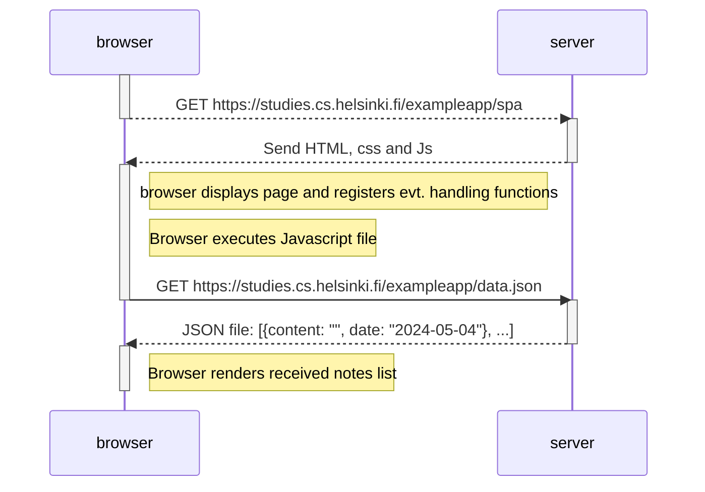

```mermaid
sequenceDiagram
    participant browser
    participant server

    activate browser
    browser-->>server: GET https://studies.cs.helsinki.fi/exampleapp/spa
    deactivate browser

    activate server
    server-->>browser: Send HTML, css  and Js
    deactivate server

    activate browser
    Note right of browser: browser displays page and registers evt. handling functions
    Note right of browser: Browser executes Javascript file
    browser->>server: GET https://studies.cs.helsinki.fi/exampleapp/data.json 
    deactivate browser

    activate server
    server-->>browser: JSON file: [{content: "", date: "2024-05-04"}, ...]
    deactivate server

    activate browser
    Note right of browser: Browser renders received notes list
    deactivate browser
```